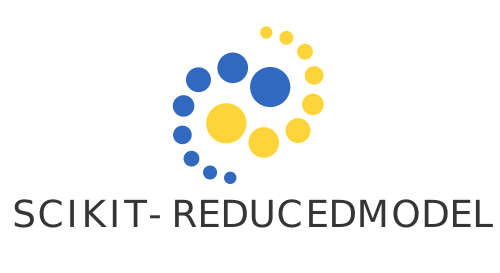

# Scikit-ReducedModel



[](https://github.com/leliel12/diseno_sci_sfw)
[](https://img.shields.io/badge/python-3.10%20-blue)
[](https://github.com/francocerino/francocerino/actions/workflows/CI.yml)


Scikit-ReduceModel is a Python package to construct reduced models. This code is an extension of the
standard reduced-base framework and provides an efficient and accurate solution for model building.
It implements the hp-greedy refinement strategy, an enhancement approach for reduced-base model
building. The approach uses a parameter space partitioning, a local reduced basis and a binary tree
as the resulting structure, all obtained automatically.
The usability of this package is similar to that of the scikit-learn modules. For usage examples, see the documentation. 

# Installation

To install the latest stable version of ScikitReducedModel from PyPI:

```bash
pip install skreducedmodel
```

To install the developer version (may be unstable):

```bash
git clone https://github.com/francocerino/scikit-reducedmodel
cd scikir-reducedmodel
pip install .
```


## Authors

- Franco Cerino <[francocerino@gmail.com](francocerino@gmail.com)> ([[FaMAF-UNC][]).

- Agustín Rodríguez-Medrano  ([IATE-OAC-CONICET][], [FaMAF-UNC][]).

[FaMAF-UNC]: https://www.famaf.unc.edu.ar/
[IATE-OAC-CONICET]: http://iate.oac.uncor.edu/
