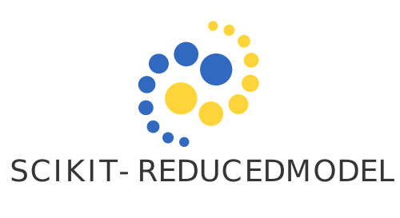

.. ScikitReduceModel documentation master file, created by
   sphinx-quickstart on Thu Nov 17 10:47:18 2022.
   You can adapt this file completely to your liking, but it should at least
   contain the root `toctree` directive.

Scikit-ReduceModel's documentation!
===================================

`Scikit-ReduceModel <https://github.com/francocerino/scikit-reducedmodel>`_ is a Python package to construct reduced model.
This code is an extension of the standard reduced-base framework and provides an efficient 
and accurate solution for model building. It implements the `hp-greedy refinement <https://arxiv.org/abs/2212.08554>`_ strategy, an enhancement 
approach for reduced-base model building. The approach uses a parameter space partitioning, a local 
reduced basis and a `binary tree <https://en.wikipedia.org/wiki/Binary_tree>` as the resulting structure, all obtained automatically.

.. toctree::
   :maxdepth: 2
   :caption: Contents:

   installation
   tutorials/index.rst
   package
   license

Indices and tables
==================

* :ref:`genindex`
* :ref:`modindex`
* :ref:`search`

Quick Usage
===========

In order to construct a reduced model, we require knowledge of a training set (training_set). 
That is, we need to be familiar with a set of functions parameterized 
by a real number λ, denoted as :math:`f_λ(x)`.

We need also a distretization of the :math:`x` (x_set) and of the :math:`λ` space (param).

Then, we can first built the reduced basis, in this case, we use the default parameters. 
::

      from skreducedmodel.reducedbasis import ReducedBasis

      rb = ReducedBasis()
      rb.fit(training_set = training_set,
            parameters = param
            physical_points = x_set)

The second step is built the empirical interpolator
:: 

      from skreducedmodel.empiricalinterpolation import EmpiricalInterpolation

      eim = EmpiricalInterpolation()
      eim.fit()

Finally, we construct the reduced model
:: 
   
      from skreducedmodel.surrogate import Surrogate

      model = Surrogate()
      model.fit()

